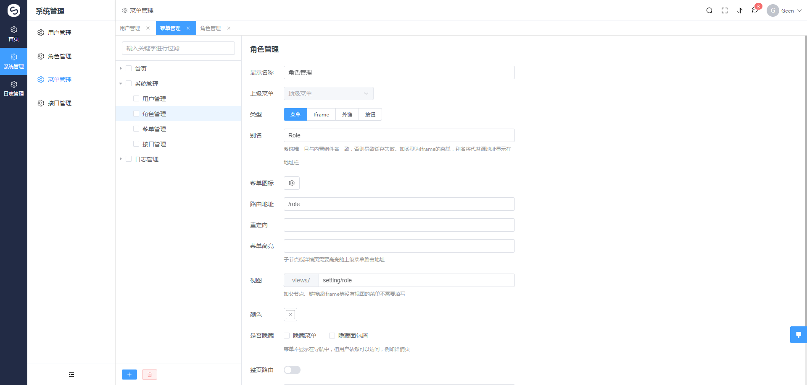
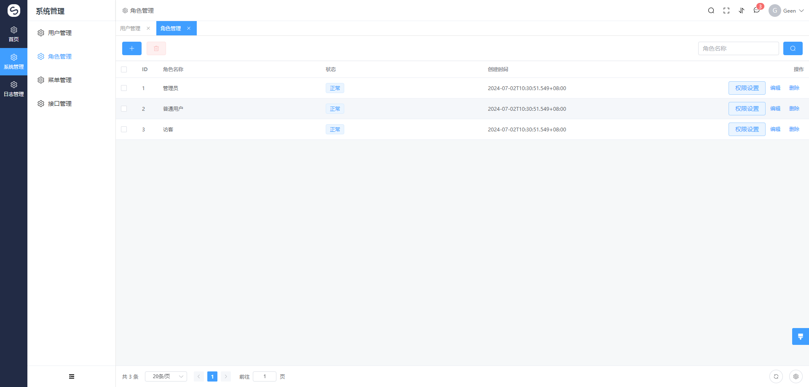

<h1 align="center">go-gin</h1>

<div align="center">
Go + SCUI开发的管理系统脚手架, 前后端分离, 仅包含项目开发的必需部分, 基于角色的访问控制(RBAC), 分包合理, 精简易于扩展。 后端Go包含了gin、 gorm、 jwt和casbin等的使用, 前端基于VUE3 SCUI开发: https://gitee.com/lolicode/scui
</div>

## Go组件

- `Gin` 一个类似于martini但拥有更好性能的API框架, 由于使用了httprouter, 速度提高了近40倍
- `MySQL` 采用的是MySql数据库
- `Jwt` 使用JWT轻量级认证, 并提供活跃用户Token刷新功能
- `Casbin` Casbin是一个强大的、高效的开源访问控制框架，其权限管理机制支持多种访问控制模型
- `Gorm` 采用Gorm 2.0版本开发, 包含一对多、多对多、事务等操作
- `Validator` 使用validator v10做参数校验, 严密校验前端传入参数
- `Lumberjack` 设置日志文件大小、保存数量、保存时间和压缩等
- `Viper` Go应用程序的完整配置解决方案, 支持配置热更新
- `GoFunk` 包含大量的Slice操作方法的工具包


## 项目截图






## 项目结构概览

```
├─common # casbin mysql zap validator 等公共资源
├─config # viper读取配置
├─controller # controller层，响应路由请求的方法
├─dto # 返回给前端的数据结构
├─middleware # 中间件
├─model # 结构体模型
├─repository # 数据库操作
├─response # 常用返回封装，如Success、Fail
├─routes # 所有路由
├─util # 工具方法
└─vo # 接收前端请求的数据结构

```
## 后端初始化
- `go mod tidy`
- `go run .`

## 前端初始化
- `npm i`
- `npm run serve`